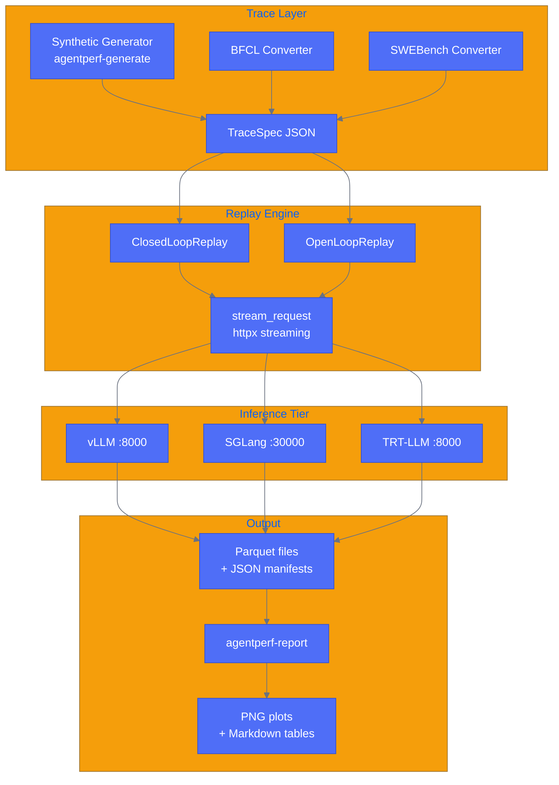
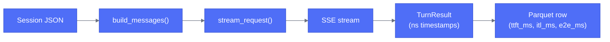

# Architecture

agentperf is organized around three concerns: describing what to replay (traces), executing the replay (the harness), and summarizing what happened (reporting). Each layer has a single job and hands off to the next through well-defined artifacts on disk.

## High-Level Pipeline

## Single-Request Data Flow

The path a single request takes through the system, from session file to Parquet row:

`build_messages()` assembles the OpenAI messages list by walking the session's turn list up to the current turn, prepending the system prompt. `stream_request()` sends the payload and records three `time.monotonic_ns()` timestamps: when the POST was sent, when the first content-bearing SSE chunk arrived, and when `[DONE]` was received. Those three nanosecond values are what every derived metric is computed from.

## Module Reference

**agentperf/clients.py** builds a reusable `httpx.AsyncClient` configured for up to 256 concurrent keepalive connections, then drives the SSE stream for each turn. Timestamps are taken with `time.monotonic_ns()` immediately before the POST and immediately after the relevant events arrive, keeping clock-reading overhead off the critical path.

**agentperf/replay.py** loads a `TraceSpec`, manages concurrency via `asyncio.Semaphore` (closed-loop) or fixed inter-arrival spacing (open-loop), collects `TurnResult` objects from all sessions, and writes the final Parquet file and JSON manifest. It is also the `agentperf-replay` CLI entry point.

**agentperf/models.py** is the single source of truth for all Pydantic models: `TraceSpec`, `SessionSpec`, `TurnSpec`, `TurnResult`, `RunManifest`, `FrameworkConfig`, and the supporting enums. Every other module imports from here and nowhere else.

**agentperf/metrics.py** contains pure stateless functions for computing `ttft_ms`, `itl_ms`, `e2e_ms`, `goodput`, `error_rate`, and `percentile`. Nothing in this module touches disk or the network. The same functions used inside `replay.py` when writing Parquet columns are available to any downstream analysis script.

**agentperf/manifest.py** creates and saves a `RunManifest` for each run. It captures a SHA-256 checksum of the trace file (to detect replay drift), a snapshot of installed package versions, the short HEAD git SHA, and whatever GPU and clock metadata the caller provides. All file I/O is offloaded to a thread pool so the async event loop is not blocked.

**agentperf/report.py** reads one or more Parquet result files, validates their schema, and generates four matplotlib plots: goodput vs. concurrency, TTFT empirical CDF, cache hit rate vs. turn depth, and a precision ladder. It also produces a GitHub-flavored Markdown table with median and p99 for `ttft_ms`, `itl_ms`, and `e2e_ms`. It is the `agentperf-report` CLI entry point and uses a non-interactive Agg backend so it is safe to run in headless environments.
