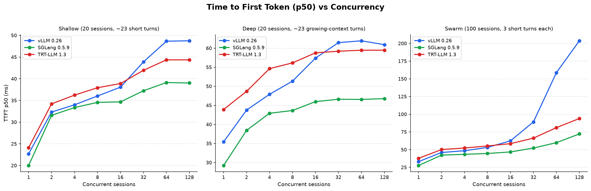
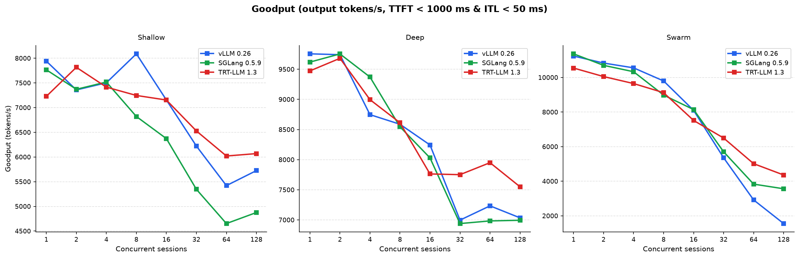
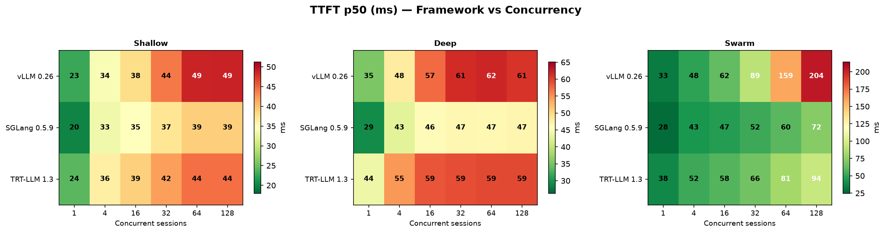
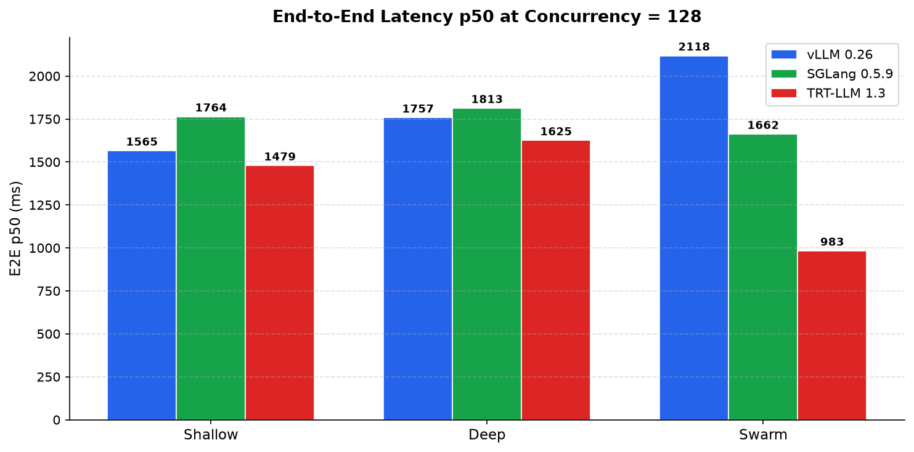

# Chapter 1 Results: Framework Comparison

**Hardware:** 96 GB workstation GPU (sm_120, 96 GB), single GPU (GPU 1), graphics clock locked at 3090 MHz
**Model:** Llama-3.1-8B-Instruct, BF16
**Sweep:** concurrency 1, 2, 4, 8, 16, 32, 64, 128 (3 independent runs per configuration)
**Traces:** agent_shallow, agent_deep, agent_swarm

---

## Single-Session Baseline

At concurrency 1, where no queuing occurs and the server processes one request at a time, SGLang leads on TTFT across all three traces. On `agent_shallow`, SGLang delivers 20 ms median TTFT vs. 23 ms for vLLM and 24 ms for TRT-LLM. On `agent_deep`, where prompts are longer, the gap widens: SGLang at 29 ms, vLLM at 35 ms, TRT-LLM at 44 ms. The TRT-LLM number at c=1 on agent_deep stands out because it reflects higher prefill overhead from the engine's internal batching machinery, which has more fixed cost per request than the interpreted runtimes at low load. On `agent_swarm`, with its shorter 4-turn sessions, the c=1 numbers are SGLang 28 ms, vLLM 33 ms, TRT-LLM 38 ms.

These baseline numbers set the floor. Everything above c=1 layers queuing and batching effects on top of them.

## Scaling Behavior

As concurrency increases, all three frameworks absorb additional load smoothly up to around c=16 to c=32. The interesting divergence happens above that threshold, and it is most visible on `agent_swarm`.

On `agent_shallow` at c=128, the frameworks are fairly close: SGLang 39 ms, TRT-LLM 44 ms, vLLM 49 ms. The range is only 10 ms, and all three remain well inside any reasonable TTFT budget. The shallow context and moderate session count mean the scheduler is not under unusual pressure.

On `agent_deep` at c=128, the pattern is similar: SGLang 47 ms, TRT-LLM 60 ms, vLLM 61 ms. Context growth across turns increases average prompt length and KV cache pressure, which pushes all three frameworks' TTFT up, but they track each other reasonably well. TRT-LLM and vLLM converge here because prefill on long sequences is mostly compute-bound, which equalizes them.

`agent_swarm` tells a different story. At c=128, SGLang reaches 72 ms (2.5x its c=1 baseline of 28 ms). TRT-LLM reaches 94 ms (2.5x its 38 ms baseline). vLLM reaches 204 ms, a 6x degradation from 33 ms at c=1. The vLLM number is not a measurement anomaly; it is consistent across all three runs (203, 202, 205 ms median TTFT) and appears in the raw data as early as c=64 (160, 163, 154 ms), with the inflection starting around c=32 (89, 89, 90 ms).

## The vLLM Scheduler Stall on agent_swarm

The pattern in `agent_swarm` is a scheduler artifact. This trace sends 100 short sessions simultaneously with high concurrency settings. When concurrency is 128, the engine sees a large wave of short independent sessions arrive at nearly the same time, with no shared prefix overlap to exploit for prefix caching. vLLM's scheduler appears to serialize the admission of these requests in a way that accumulates queuing delay, producing the steep TTFT climb. SGLang and TRT-LLM both handle the same workload with roughly 2.5x TTFT growth rather than 6x, suggesting their admission and batching logic handles the fan-out pattern more efficiently.

This is a workload-specific weakness rather than a general vLLM performance problem. On `agent_shallow` and `agent_deep`, where sessions are fewer and context is more structured, vLLM does not exhibit the same stall behavior. Engineers deploying vLLM for multi-agent systems where hundreds of independent short sessions arrive simultaneously should expect TTFT to degrade faster than on longer, fewer concurrent workloads.

## End-to-End Latency at High Concurrency

On `agent_swarm` at c=128, TRT-LLM achieves the lowest median E2E latency at 983 ms, compared to 1662 ms for SGLang and 2118 ms for vLLM. This reversal relative to the TTFT ordering is explained by token streaming throughput. TRT-LLM's compiled kernels and fused decode path produce tokens faster once a request is being served, which more than compensates for its higher TTFT at the single-session baseline. When the session is only 4 turns long and each response is short, the decode phase matters proportionally more to E2E time.

SGLang's advantage is in TTFT and tail TTFT stability, not raw decode throughput. For agent workloads that are latency-sensitive at the first token (streaming responses to a user, triggering a downstream API call on the model's first output token), SGLang's scheduler is the better fit. For workloads where total completion time matters more than time to first token, TRT-LLM's decode efficiency becomes the dominant factor.

## Summary

SGLang has the lowest TTFT across all three traces and all concurrency levels tested. Its TTFT growth from c=1 to c=128 is the most controlled: 2.5x on agent_swarm, roughly 2x on agent_shallow. vLLM matches SGLang closely on shallow and deep traces but exhibits a 6x TTFT inflation on agent_swarm above c=32. TRT-LLM sits between the two on TTFT but leads on E2E latency at high concurrency thanks to faster decode throughput.

For a deployment on 96 GB workstation GPU running Llama-3.1-8B-Instruct at BF16 and expecting mixed agentic workloads with concurrent short sessions, SGLang is the lowest-risk choice on TTFT, and TRT-LLM is the choice if minimizing total completion time is the priority. vLLM performs well on structured workloads but warrants additional investigation before deployment under high-fan-out short-session patterns.
