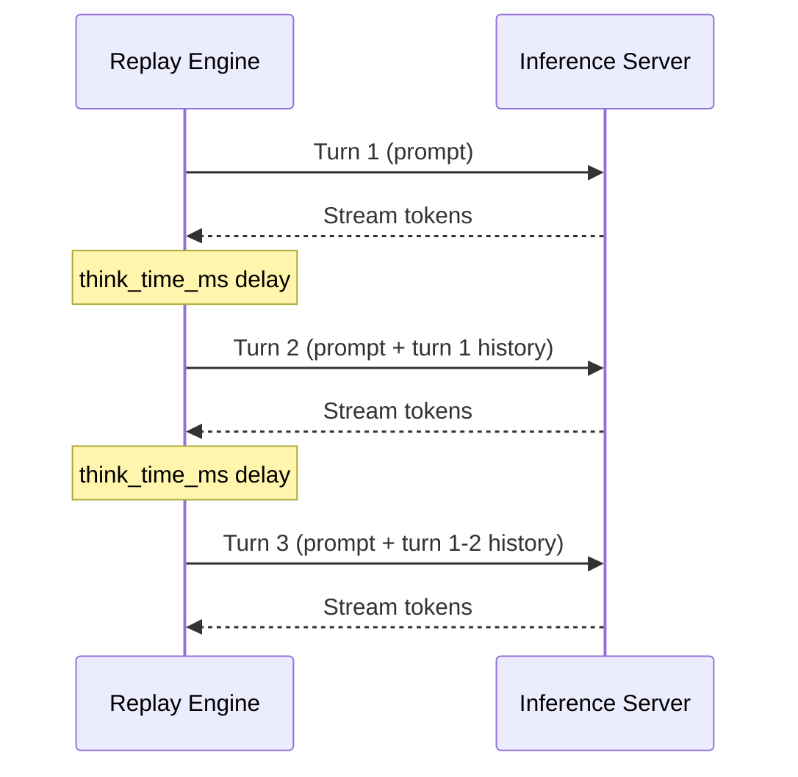

# Traces

A trace is a JSON file that describes a set of sessions. Each session is an ordered sequence of turns, and each turn carries the prompt content, sampling parameters, and a `think_time_ms` value that controls how long the replay engine waits before sending the next turn. The trace format is the same regardless of which framework is under test; the same file can be replayed against vLLM, SGLang, or TRT-LLM without modification.

## Trace Types

**agent_shallow** contains 50 sessions with roughly 7 turns each. Prompts are short and self-contained, with no tool-result accumulation across turns. Think times are in the 800-1500 ms range, simulating a human or orchestrator that processes responses quickly before sending the next message. This trace is designed to stress the scheduler's ability to handle moderate concurrency at stable, low context lengths. Because the prompt size does not grow across turns, it isolates scheduling overhead from KV cache pressure.

**agent_deep** contains 20 sessions with about 23 turns each. Turns include both `user` and `tool_result` role sequences, and context grows steadily as tool outputs are appended to the conversation. By turn 15, prefill prompts reach 8-15k tokens. This trace exercises KV cache behavior under sustained context growth and is the most sensitive to cache hit rate differences between frameworks. Frameworks that implement prefix caching should show a flattening TTFT curve as the shared system prompt prefix gets cached after the first few sessions.

**agent_swarm** contains 100 sessions with roughly 3 turns each. All sessions are short and arrive nearly simultaneously when concurrency is high. This trace is designed to stress scheduler fan-out: at concurrency 128, the engine receives 100 independent short sessions whose first turns all land within a narrow window. TTFT stability under this fan-out pattern is the primary signal. Frameworks that batch new requests efficiently before the first decode step perform well here; those that serialize admission or stall on prefill scheduling show sharp TTFT degradation.

## Schema

A trace file has the following structure. All fields are required unless noted.

```json
{
  "trace_id": "agent_shallow-seed42",
  "schema_version": 1,
  "sessions": [
    {
      "session_id": "session-0000-31887ef3-...",
      "system_prompt_ref": "<inline text or @path/to/file.txt>",
      "turns": [
        {
          "turn_id": 0,
          "role_sequence": "user",
          "content_ref": "<inline text or @path/to/file.txt>",
          "sampling": {
            "temperature": 0.786,
            "max_tokens": 589,
            "top_p": 0.826
          },
          "expects_tool_call": false,
          "think_time_ms": 1162
        }
      ]
    }
  ]
}
```

`trace_id` is a stable identifier that gets recorded in the run manifest alongside the trace file's SHA-256 checksum, so results can always be matched back to the exact trace version that produced them.

`schema_version` must be 1. The Pydantic model validator will reject any other value.

`system_prompt_ref` and `content_ref` both accept either inline text or a file reference prefixed with `@`. When the replay engine sees an `@`-prefixed value, it reads the file at the specified path. This allows large shared system prompts to live in a single file rather than being duplicated across every session in the JSON.

`role_sequence` is either `user` or `tool_result`. Because not all OpenAI-compatible servers support a dedicated tool role, `tool_result` turns are sent as user messages with a `[tool_result] ` prefix prepended to the content. The model can distinguish them, and the server does not need to understand a non-standard role.

`think_time_ms` is the delay the replay engine applies after receiving the server's response for that turn, before sending the next one. It is applied between turns only, not after the last turn of a session.

`expects_tool_call` is a hint for quality evaluation scripts (not used by the replay engine itself).

## Turn Sequencing

Within a session, turns are replayed sequentially. The replay engine calls `build_messages()` before each turn, which assembles the full conversation history up to that turn index. Turn N's prompt therefore contains the content of turns 0 through N-1 as prior user messages, making each request independent from the server's perspective (the client maintains state, not the server).



The consequence is that KV cache can only be reused for the shared prefix (the system prompt and any turns that are identical across sessions). In `agent_deep`, the system prompt is long and shared, so the cache hit rate climbs through the warmup period and stays high once the prefix is resident.
